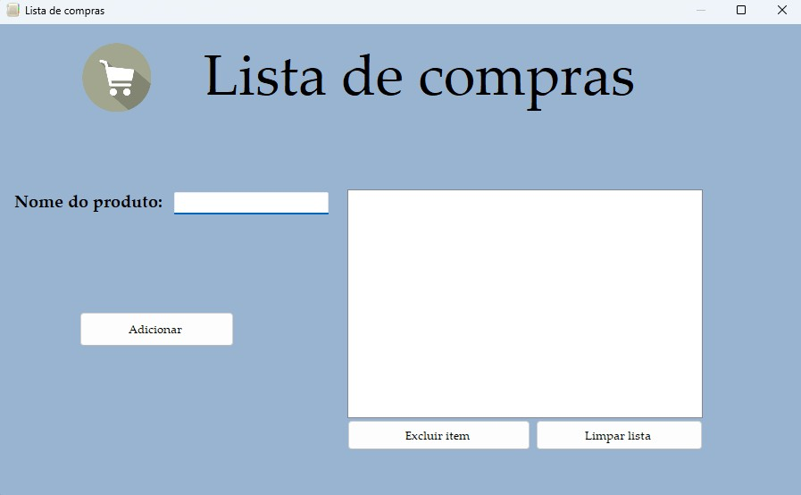

# 🛒 Lista de Compras - Windows Forms (C#)

Este é um programa simples de gerenciamento de **lista de compras**, desenvolvido com **Windows Forms em C#**. Ele permite adicionar, visualizar e remover itens de uma lista de forma prática e intuitiva.

## 📸 Captura de Tela

---

## 🎯 Funcionalidades

- ✅ Adicionar itens à lista de compras.
- ✅ Visualizar todos os itens adicionados no `ListBox`.
- ✅ Remover um item selecionado da lista.
- ✅ Limpar toda a lista com um único clique.
- ✅ Interface amigável com foco em usabilidade.

---

## 🧠 Como Usar

1. **Digite o nome do item** no `TextBox`.
2. **Clique no botão "Adicionar"** para inserir o item na lista.
3. Para **remover um item específico**, selecione-o no `ListBox` e clique em **"Remover Selecionado"**.
4. Para **apagar todos os itens da lista**, clique em **"Limpar Lista"**.

---

## 🛠️ Tecnologias Utilizadas

- C#
- .NET Framework / Windows Forms
- Visual Studio

---

## 📁 Estrutura Básica do Projeto

